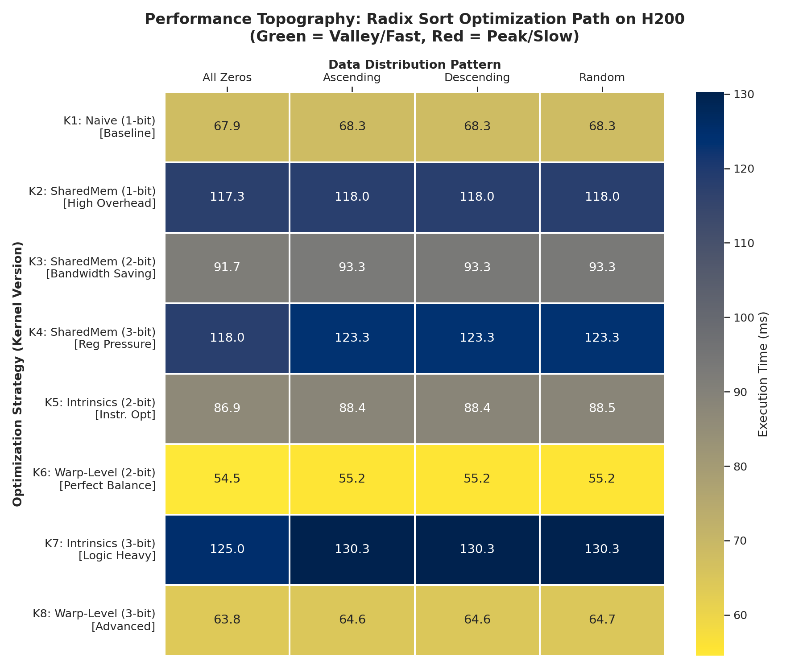
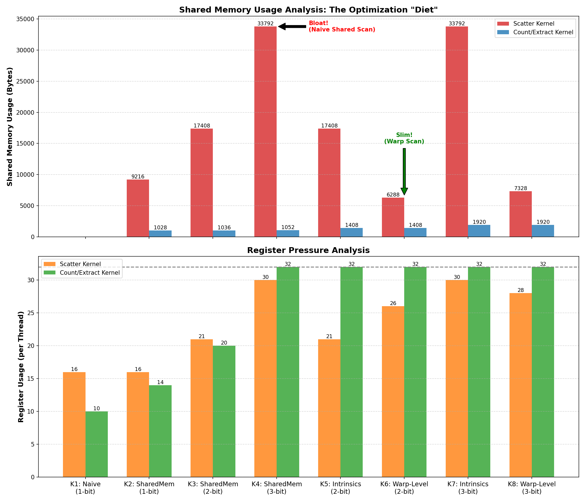
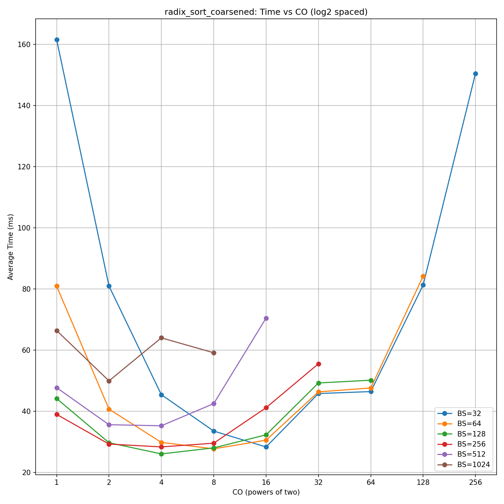
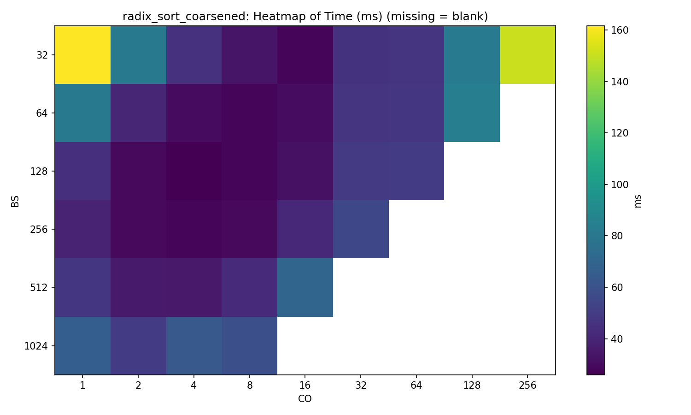
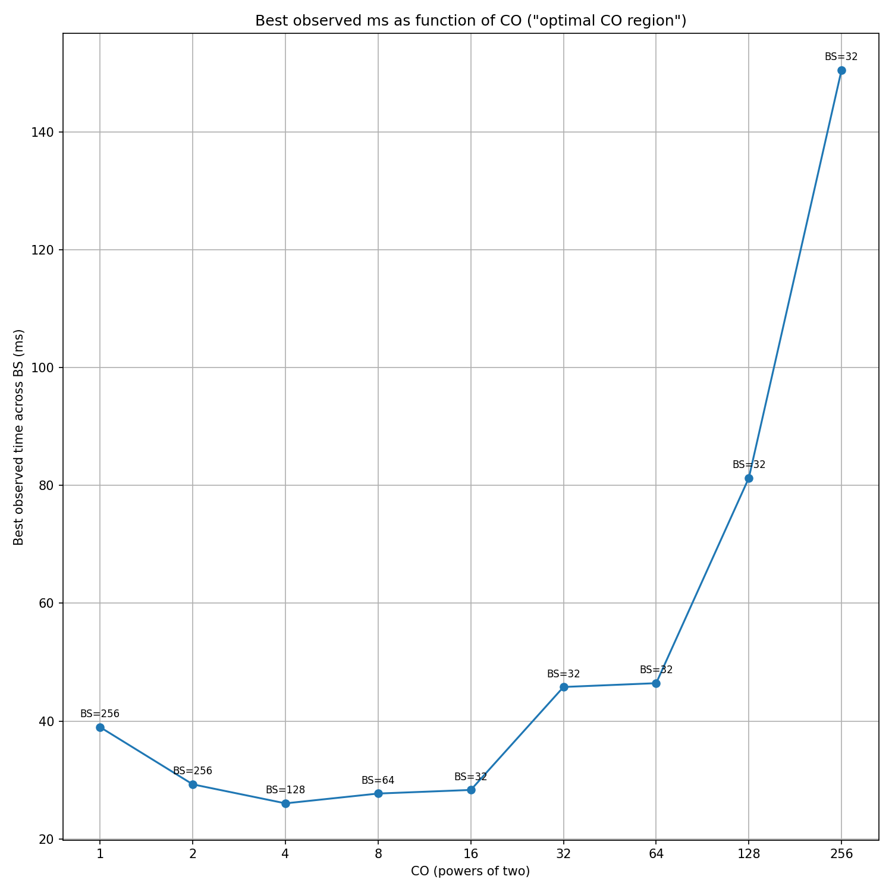

# Chapter 13: Sorting (排序算法)

本章主要介绍排序算法的实现。尽管原书涉及了 Merge Sort 等多种排序方法，本项目的实验重点聚焦于 **Radix Sort (基数排序)** 的 CUDA 实现与性能优化。

## Kernels and Experiments (实验概览)

本章包含的实验项目如下表所示：

| 实验序号 | 内核文件 (Kernel) | 正确性检验 (Correctness) | 性能测试 (Benchmark) | 改进基准 |
| --- | --- | --- | --- | --- |
| **实验 1** | `sort_kernels_1.cuh` | `test_correctness_1.cu` | `benchmark_1.cu` | - |
| **实验 2** | `sort_kernels_2.cuh` | `test_correctness_2.cu` | `benchmark_2.cu` | 实验 1 |
| **实验 3** | `sort_kernels_3.cuh` | `test_correctness_3.cu` | `benchmark_3.cu` | 实验 2 |
| **实验 4** | `sort_kernels_4.cuh` | `test_correctness_4.cu` | `benchmark_4.cu` | 实验 3 |
| **实验 5** | `sort_kernels_5.cuh` | `test_correctness_5.cu` | `benchmark_5.cu` | 实验 3 |
| **实验 6** | `sort_kernels_6.cuh` | `test_correctness_6.cu` | `benchmark_6.cu` | 实验 5 |
| **实验 7** | `sort_kernels_7.cuh` | `test_correctness_7.cu` | `benchmark_7.cu` | 实验 4, 实验 5 |
| **实验 8** | `sort_kernels_8.cuh` | `test_correctness_8.cu` | `benchmark_8.cu` | 实验 6, 实验 7 |
| **实验 9** | `sort_kernels_6.coarsened.cuh` | `test_correctness_6.coarsened.cu` | `benchmark_6.coarsened.cu` | 实验 6 |

### 实验详情

#### 实验 1：Naive Implementation

这是最朴素的基准版本。该版本全程直接读写 Global Memory，预期性能最低。

* **注意**：Figure 13.4 给出的伪代码中包含 `exclusiveScan(bits, N)`。这是一个全局 Scan 操作，而非 Block 内部 Scan。因此，它需要启动一个新的 Kernel。为专注于 Radix Sort 本身，我们在中间步骤直接调用了 `thrust::exclusive_scan`。

#### 实验 2：Shared Memory Optimization

引入 Shared Memory。每个 Block 先在 Shared Memory 内部进行排序，随后合并访问写入 Global Memory。

#### 实验 3：Radix-4

将基数（Radix）从 2 (1-bit) 扩展为 4 (2-bit)。

#### 实验 4：Radix-8 (Basic)

在实验 3 的基础上，进一步将基数扩展为 8 (3-bit)。

#### 实验 5：Optimized Counting

基于 `sort_kernels_3.cuh`，对 `radix_sort_count_block` 进行了优化。

* **优化点**：利用 Warp-level primitives。相比于适合收集具体数据的 `__shfl_down_sync`，这里使用了更适合收集 Bool 状态的 `__ballot_sync` 配合 `__popc`，从而高效地统计 "1" 的个数。

#### 实验 6：Optimized Scattering

基于 `sort_kernels_5.cuh`，对 `radix_sort_coalesced_scatter` 进行了优化。

* **优化点**：替换了原书中基于 `Chapter 11` 的低性能版 `Kogge-Stone algorithm`，改用高效的 `__ballot_sync` 和 `__popc` 实现。

#### 实验 7：Radix-8 + Optimized Counting

基于 `sort_kernels_5.cuh` 的优化思路，将基数扩展到 8。

#### 实验 8：Radix-8 + Optimized Scattering

基于 `sort_kernels_6.cuh` 的优化思路，将基数扩展到 8。

#### 实验 9：Coarsening (Thread Coarsening)

选取此前性能最佳的实验 6 Kernel (`sort_kernels_6.cuh`) 进行粗化处理（Coarsening）。即每个 Thread 处理多个数据元素。

* 我们设置了可调整参数 `BLOCK_SIZE` 和 `COARSEN` (粗化程度) 进行参数空间搜索。

---

## 实验结果与分析

### 1. 实验 1-8 性能演进分析

**测试环境**：NVIDIA H200 (141GB)
**测试序列**：全 0 序列、升序序列、降序序列、随机序列。

**主要观察结论：**

1. **Shared Memory 开销 (Exp 2 vs Exp 1)**：
实验 2 的性能反而低于实验 1。这说明引入 Shared Memory 带来的算法步骤复杂度增加，其开销远超其带来的访存收益。H200 强大的 L2 Cache 使得直接访问 Global Memory 的朴素版本依然具有竞争力。
* *注*：代码中用于 Scan 的 `Kogge-Stone` 算法实现（源自 Chapter 11）性能过低，主要仅具算法教学意义，严重拖累了性能。

2. **Radix 大小的权衡 (Exp 3 vs Exp 4)**：
实验 3 优于实验 2，说明增大基数（Radix）减少了迭代次数，提高了效率。但实验 4 性能低于实验 3，这是因为 Radix-8 导致寄存器和 Shared Memory 占用显著增加，从而降低了 Occupancy。
3. **Warp-level Primitives 的优势 (Exp 6)**：
实验 6 性能最佳。这证实了在 Warp 内部优先进行数据收集和处理的高效性。利用寄存器进行 Warp 层级的操作，减少了对 Shared Memory 的依赖。
4. **资源瓶颈 (Exp 7 & 8)**：
实验 7 和 8 尽管采用了优化策略，但由于 Radix-8 带来的高资源消耗导致 Occupancy 下降，性能依旧不如 Radix-4 的优化版本（实验 5 和 6）。

### 2. 实验 9：参数空间搜索 (Performance Heatmap)

我们对 `Block_Size` (32~1024) 和 `COARSEN` (1~1024) 的两两组合进行了详尽测试。

* **注**：表格中 `-` 表示该组合因寄存器或 Shared Memory 资源需求过大，导致 Kernel 无法启动。

#### 2.1 Kernel Runtime (ms)

数据展示了明显的性能“甜点区”（Sweet Spot）。

| Block Size \ Coarsening |          1 |             2 |             4 |             8 |            16 |        32 |        64 |       128 |        256 |
| ----------------------: | ---------: | ------------: | ------------: | ------------: | ------------: | --------: | --------: | --------: | ---------: |
|                  **32** | 161.592827 |     80.971284 |     45.418840 |     33.526192 | **28.319040** | 45.792926 | 46.436958 | 81.283205 | 150.499213 |
|                  **64** |  80.936179 |     40.702309 |     29.813076 | **27.708961** |     30.541148 | 46.336899 | 47.622131 | 84.207284 |          - |
|                 **128** |  44.165486 |     29.711831 | **26.044274** |     28.015491 |     32.274519 | 49.250863 | 50.157660 |         - |          - |
|                 **256** |  38.975468 |     29.266344 | **28.333358** |     29.551520 |     41.149399 | 55.531062 |         - |         - |          - |
|                 **512** |  47.721560 | **35.593579** |     35.249997 |     42.485775 |     70.458574 |         - |         - |         - |          - |
|                **1024** |  66.418224 | **49.938743** |     64.013246 |     59.129605 |             - |         - |         - |         - |          - |

我们做了以下图来展示这组数据

#### 2.2 资源使用分析

以下表格记录了关键 Kernel 在不同配置下的资源消耗，解释了部分配置无法启动的原因。

#### 1️⃣ `radix_sort_coalesced_scatter` —— REG

| Block Size \ Coarsening | 1  | 2  | 4  | 8  | 16 | 32  | 64 | 128 | 256 |
| ----------------------- | -- | -- | -- | -- | -- | --- | -- | --- | --- |
| 32                      | 19 | 27 | 36 | 51 | 64 | 98  | 32 | 32  | 32  |
| 64                      | 22 | 30 | 36 | 55 | 72 | 102 | 32 | 32  | -   |
| 128                     | 26 | 30 | 40 | 51 | 72 | 98  | 32 | -   | -   |
| 256                     | 26 | 30 | 36 | 48 | 72 | 102 | -  | -   | -   |
| 512                     | 30 | 30 | 40 | 47 | 72 | -   | -  | -   | -   |
| 1024                    | 26 | 30 | 36 | 47 | -  | -   | -  | -   | -   |

#### 2️⃣ `radix_sort_coalesced_scatter` —— SHARED（Bytes）

| Block Size \ Coarsening | 1    | 2     | 4     | 8     | 16    | 32    | 64    | 128   | 256   |
| ----------------------- | ---- | ----- | ----- | ----- | ----- | ----- | ----- | ----- | ----- |
| 32                      | 1204 | 1368  | 1696  | 2352  | 3664  | 6288  | 11536 | 22032 | 43024 |
| 64                      | 1368 | 1696  | 2352  | 3664  | 6288  | 11536 | 22032 | 43024 | -     |
| 128                     | 1696 | 2352  | 3664  | 6288  | 11536 | 22032 | 43024 | -     | -     |
| 256                     | 2352 | 3664  | 6288  | 11536 | 22032 | 43024 | -     | -     | -     |
| 512                     | 3664 | 6288  | 11536 | 22032 | 43024 | -     | -     | -     | -     |
| 1024                    | 6288 | 11536 | 22032 | 43024 | -     | -     | -     | -     | -     |

#### 3️⃣ `radix_sort_count_block` —— REG

| Block Size \ Coarsening | 1  | 2  | 4  | 8  | 16 | 32 | 64 | 128 | 256 |
| ----------------------- | -- | -- | -- | -- | -- | -- | -- | --- | --- |
| 32                      | 20 | 20 | 20 | 29 | 32 | 32 | 32 | 32  | 32  |
| 64                      | 20 | 20 | 20 | 29 | 32 | 32 | 32 | 32  | -   |
| 128                     | 22 | 22 | 22 | 29 | 32 | 32 | 32 | -   | -   |
| 256                     | 32 | 32 | 32 | 32 | 32 | 32 | -  | -   | -   |
| 512                     | 34 | 34 | 34 | 34 | 39 | -  | -  | -   | -   |
| 1024                    | 34 | 34 | 34 | 34 | -  | -  | -  | -   | -   |

#### 4️⃣ `radix_sort_count_block` —— SHARED（Bytes）

| Block Size \ Coarsening | 1    | 2    | 4    | 8    | 16   | 32   | 64   | 128  | 256  |
| ----------------------- | ---- | ---- | ---- | ---- | ---- | ---- | ---- | ---- | ---- |
| 32                      | 1036 | 1036 | 1036 | 1036 | 1036 | 1036 | 1036 | 1036 | 1036 |
| 64                      | 1048 | 1048 | 1048 | 1048 | 1048 | 1048 | 1048 | 1048 | -    |
| 128                     | 1072 | 1072 | 1072 | 1072 | 1072 | 1072 | 1072 | -    | -    |
| 256                     | 1120 | 1120 | 1120 | 1120 | 1120 | 1120 | -    | -    | -    |
| 512                     | 1216 | 1216 | 1216 | 1216 | 1216 | -    | -    | -    | -    |
| 1024                    | 1408 | 1408 | 1408 | 1408 | -    | -    | -    | -    | -    |

> **结论**：每个 Block Size 能运行的最大 Coarsening Factor，恰好对应 `scatter` kernel 的 Shared Memory 占用接近硬件限制（约 43024 bytes）。

## 致谢

本章的实验代码实现、数据分析及图表制作，以及本README文件本身，受到了 **ChatGPT 5.2** 和 **Gemini 3 Pro** 的辅助支持。